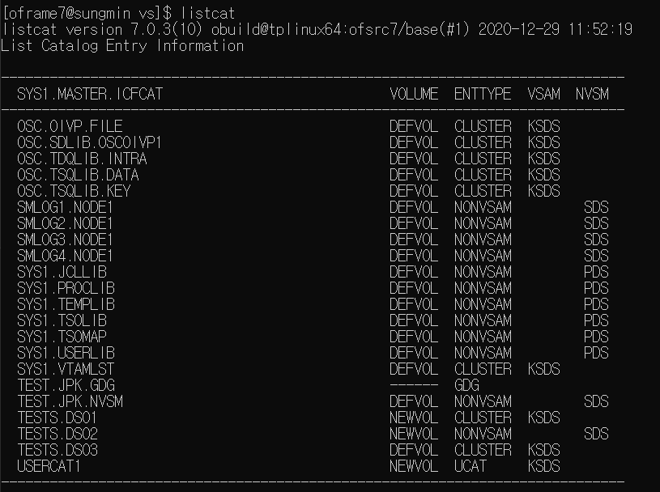
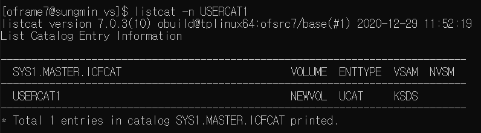
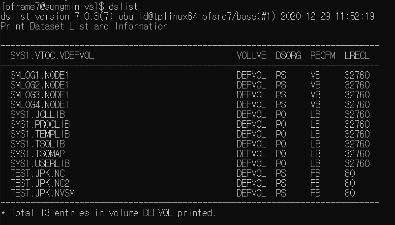
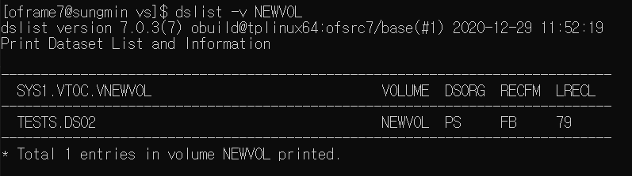

## DataSet Usage Examples

### - Objective: create a dataset with no catalog viewable

- Case 1: create user defined catalog then give it as entry
        
        idcams define UCAT -n USERCAT1 -v NEWVOl
        dscreate TEST.JPK.NC -c USERCAT1
- Case 2: create with -N Option
        
        dscreate TEST.JPK.NC2 -N

### Results
- listcat command
    
    Case 1 & 2 does not appear on first command
    
     Case 1 can be found with -n option\
     Case 2 cannot be found with given command
- dslist command
    
    
  Both datasets in Case 1&2 are visual

    

