## Tacf practices

### 1.인증 인가의 차이점 with Resource examples

인증(Authentication) : A user is able to Login to the system.

인가(Authorize) : A user is able to read/alter/update datasets or use utilities with permission

### 2.Tacf command practices

- create 6 users
  
  - 1 special user 
    
        ADDUSER SPCL SPECIAL NAME('RU') OWNER(ROOT) PASSWORD(T1234)
        
    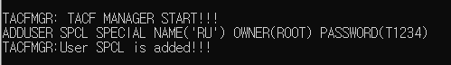
    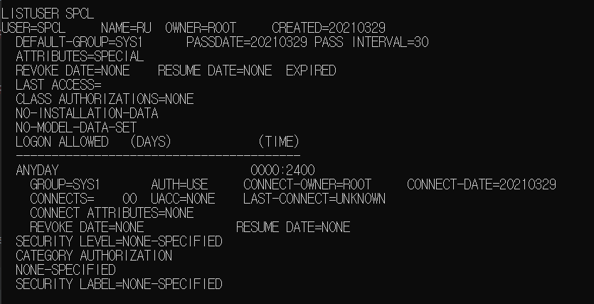
    
  - 1 auditor attribute
    
        ADDUSER ADT AUDITOR(ALL(READ,DELETE)) PASSWORD(A1234)

    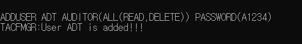
    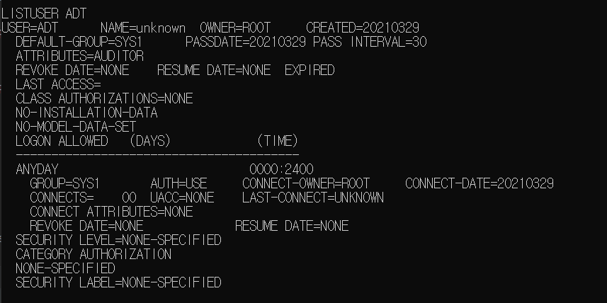
    
  - 1 No password user
    
        ADDUSER NPW NOPASSWORD 

    
    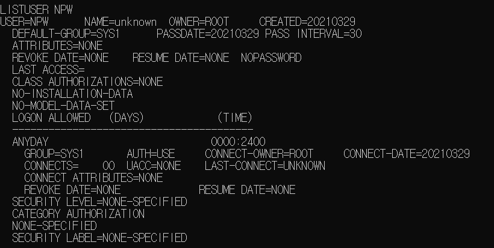
        
    
  - 3 no attribute user
    
        ADDUSER NAT1 
        ADDUSER NAT2
        ADDUSER NAT3

    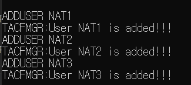
    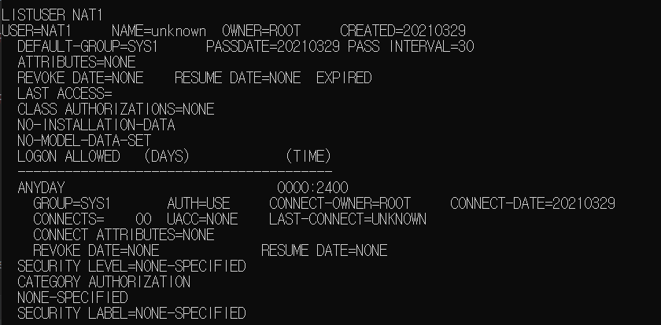

  - 
    

- create 3 groups

  - Each group with 2 users each (All groups ar sup/sub of the other)
    
    Group1
    
        ADDGROUP GRP01 OWNER(SPCL)
        CONNECT SPCL GROUP(GRP01)
        ALTUSER SPCL DFLTGRP(GRP01)
        CONNECT NAT1 GROUP(GRP01)
    
    Group1 creation and first user connection (&defalt group test)
    
    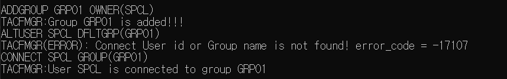  
    
    Defualt group setting
    
    Connect second user to group
    
    Group 1 Attribute
    
    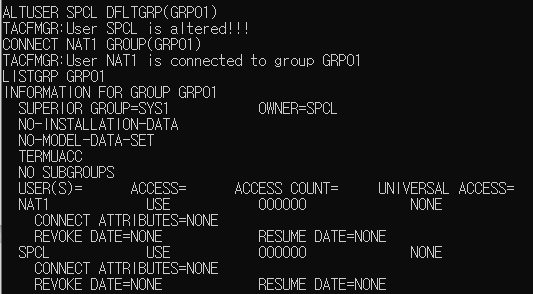
    
    Connected user data 
    
    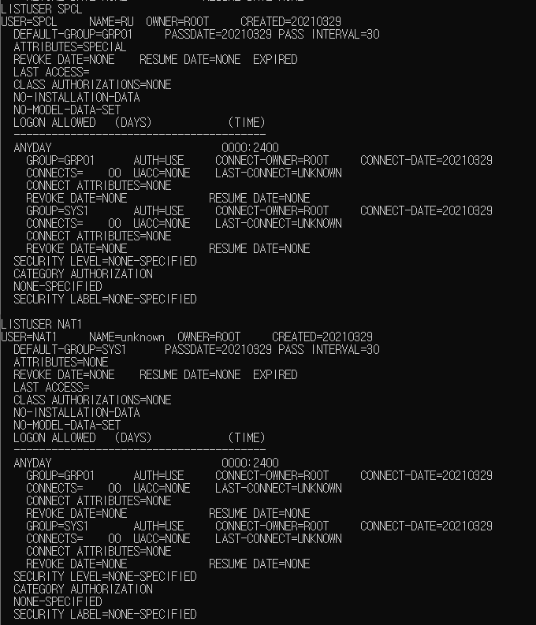

    Group2
    
        ADDGROUP GRP02 SUPGROUP(GRP01)
        CONNECT ADT GROUP(GRP02)
        CONNECT NAT2 GROUP(GRP02)
    
    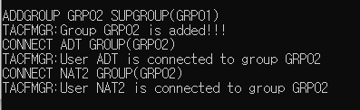
  
    Group2 data

    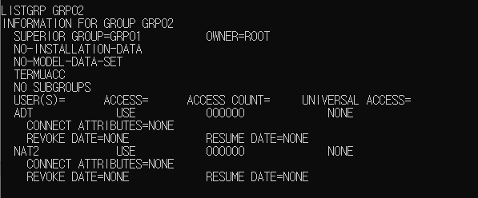
  
    User Attributes

    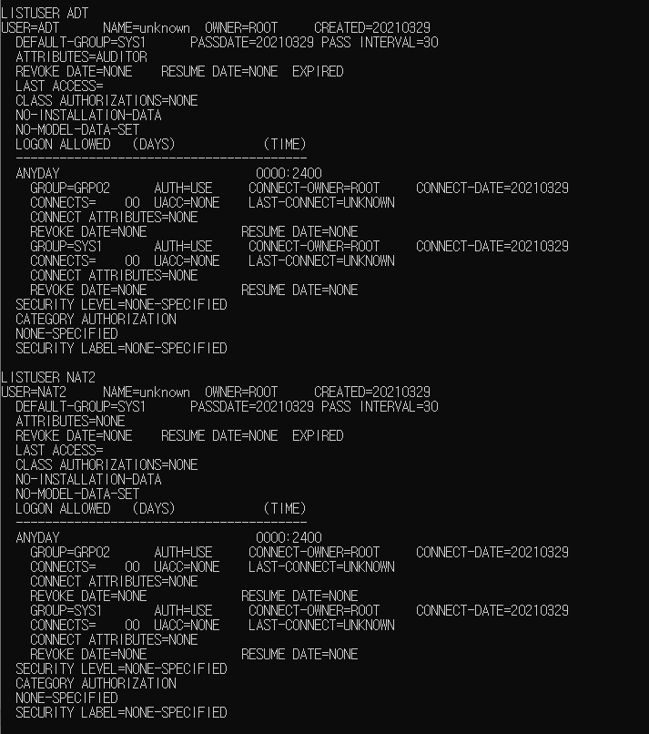
    
    Group3
    
        ADDGROUP GRP03
        ALTGROUP GRP03 SUPGROUP(GRP02)
        CONNECT NPW GROUP(GRP03)
        CONNECT NAT2 GROUP(GRP03)

    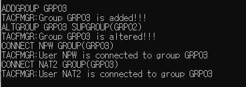
  
    Group data
    
    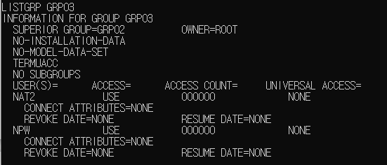
    
    User data
    
    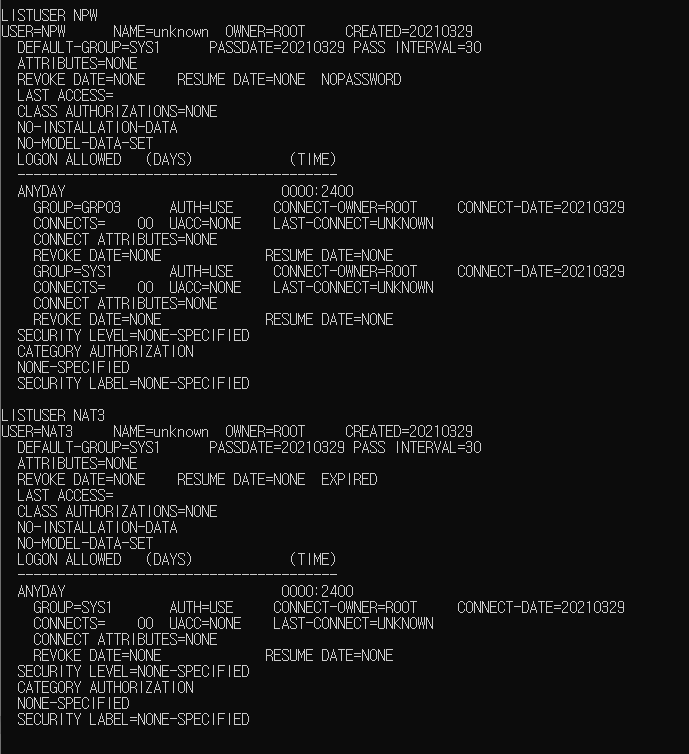
  
  - sub results
    
    2 is sub of 1    

    

    3 is sub of 2  
    
    

- create 6 datasets

  - 3 DS, naming convention rules, only 1 group with Alter allowed
  
    (NON-VSAM DS needs volumes, VSAM does not use volume or UNIT)
        
        dscreate SPCL.FRST.DATA
        dscreate SPCL.SCND.TEST
        dscreate SPCL.THRD.COBOL
    
    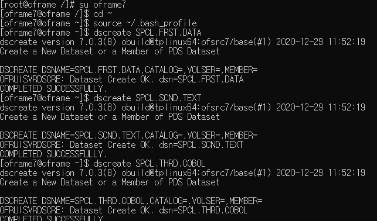
    
        ADDSD SPCL.*.** UNIT(G) VOLUME(DEFVOL) 
        PERMIT 'SPCL.*.**'  ACCESS(ALTER) ID(GRP01)
        ALTDSD SPCL.*.** UNIT(G) VOLUME(DEFVOL) UACC(NONE)
    
    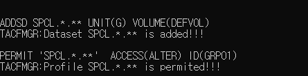

    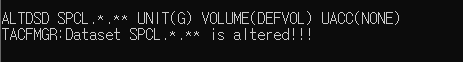
        
    Commands not used
        
        ADDSD SPCL.*.**  UACC(NONE)  UNIT(G) VOLUME(DEFVOL)
        DELDSD SPCL.*.**
        ALTDSD SPCL.*.** VOLUME(DEFVOL) UNIT(G) UACC(NONE)
        ALTDSD SPCL.FRST.DATA UNIT(G) VOLUME(DEFVOL) 
        PERMIT 'SPCL.FRST.DATA'  ACCESS(ALTER) ID(GRP01)
        *ADDSD SPCL.SCND.TEXT UNIT(G) VOLUME(DEFVOL) UACC(NONE)
        *ADDSD SPCL.THRD.COBOL UNIT(G) VOLUME(DEFVOL) UACC(NONE)
        
        *LISTDSD DATASET('SPCL.FRST.DATA')

        *PERMIT 'SPCL.*.**'  ACCESS(ALTER) ID(GRP01)
        *PERMIT 'SPCL.FRST.DATA'  ACCESS(ALTER) ID(GRP01)
        *PERMIT 'SPCL.SCND.TEXT' ACCESS(READ) ID(GRP02) 
        *PERMIT 'SPCL.THRD.COBOL' ACCESS(ALTER) ID(GRP01)
        *PERMIT 'SPCL.FRST.DATA' ID(GRP02) ACCESS(READ)
  
  - 2 datasets READ for all groups

        ADDSD TEST.RD.DS001 UACC(READ) UNIT(G) VOLUME(DEFVOL)
        ADDSD TEST.RD.DS002
        PERMIT 'TEST.RD.DS002' ID(*) ACCESS(READ)
        LISTDSD DATASET(TEST.RD.DS002)
        
      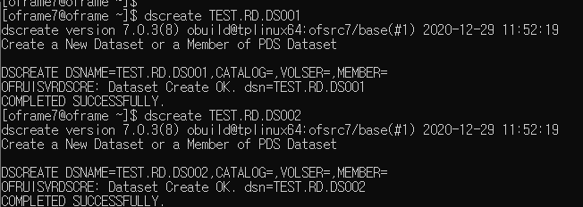
      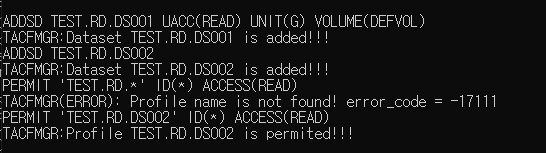
        
    
  - 1 discrete dataset profile

        ADDSD TEST.DSCRT.DS001 UNIT(D)
        *ALTDSD TEST.DSCRT.DS001 UNIT(D)

     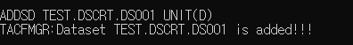

    

- Authorization 

  - 1 group authorized MWF 14:00 ~ 19:00
        
        RDEFINE OFMANAGR LGN 
        PERMIT LGN CLASS(OFMANAGR) ID(GRP02) WHEN(DAYS(MONDAY,WEDNESDAY,FRIDAY) TIME(1400:1900) )
        
      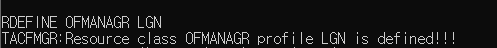

      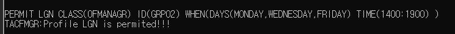

        *PERMIT LGN ACCESS() GROUP(GRP1) WHEN(DAYS(ANYDAY) TIME(0000:2400) )
        *PERMIT LGN ACCESS() GROUP(GRP3) WHEN(DAYS(ANYDAY) TIME(0000:2400) )
  
    
  - only 1 group is allowed to run JCL through TJESMGR

        RDEFINE TJESMGR TJM NOTIFY(ROOT) OWNER(ROOT) UACC(NONE)

        PERMIT TJM CLASS(TJESMGR) ID(GRP01) ACCESS(READ)

    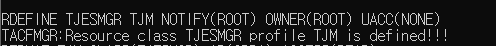    

      

  - only 1 group is allowed to VIEW SPOOL through tjesmgr
    
        RDEFINE JESSPOOL JSP OWNER(ROOT) UACC(NONE)
    
        PERMIT JSP CLASS(JESSPOOL) ID(GRP03) ACCESS(READ)

    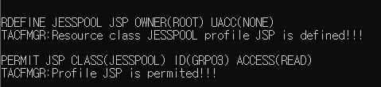

### 2-2

- issues
  
  - default group & group access trials
    
    - tried giving default group for NAT1
  
    - SPCL(GRP01) user have access to SPCL.** datasets(probably because of Naming)
  
    - TEST.RD.** datasets have UACC but no access from accounts
  
    
  

### 3.  24-29

- nslcd conf setting different from ppt

      base  dc=example,dc=com

- user info (ldap_data2.ldif)
    
      dn: uid=tmax,ou=People,dc=example,dc=com
      objectClass: inetOrgPerson
      objectClass: posixAccount
      objectClass: shadowAccount
      uid: tmax
      sn: LASTNAME
      givenName: FIRSTNAME
      cn: FULLNAME
      displayName: DISPLAYNAME
      uidNumber: 10000
      gidNumber: 5000
      userPassword: banana
      gecos: FULLNAME
      loginShell: /bin/bash
      homeDirectory: USERDIRECTORY

  add user

      ldapadd -x -D cn=admin,dc=example,dc=com -W -f ldap_data2.ldif

  search user from client

      ldapsearch -h 10.36.31.61 -x -b "uid=tmax,ou=People,dc=example,dc=com"

  

- ldap user check from client server (tmax banana)

  

- ldap safp success, tacf failure

- steps to use ldap with above error 

      1. safp -d command works
      2. tacflogin doesn't work
      3. OSCOIVP1 region fails on PAM=YES, works on PAM=NO 
        (faild because CICS_USER & ROOT/sys1 doesn't exist in ldap)
      4. tried giving ROOT/SYS1 => logs in as root/sys, but not tmax/banana
          ldapsearch -h 10.36.31.61 -x -b "uid=ROOT,ou=People,dc=example,dc=com"
      ======================================== ldap_data.ldif
      dn: uid=ROOT,ou=People,dc=example,dc=com
      objectClass: inetOrgPerson
      objectClass: posixAccount
      objectClass: shadowAccount
      uid: ROOT
      sn: LASTNAME
      givenName: FIRSTNAME
      cn: FULLNAME
      displayName: DISPLAYNAME
      uidNumber: 10000
      gidNumber: 5000
      userPassword: SYS1
      gecos: FULLNAME
      loginShell: /bin/bash
      homeDirectory: USERDIRECTORY
      ========================================
      5. "ADDUSER tmax AUDITOR(ALL(READ,DELETE)) PASSWORD(berry)"
      6. ldap works!!!
  
   banana : ldap passwd (PAM=YES)
  
   

- conclusion
  
  using PAM & ldap must need user in original database 

