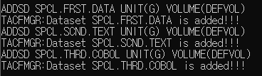

## Tacf practices

### 인증 인가의 차이점 with Resource examples

인증 : USER is able to list resources

인가 : USER is able to run allowed commands to that specific resource

### Tacf command prac

- create 6 users
  
  - 1 special user 
    
        ADDUSER SPCL SPECIAL NAME('RU') OWNER(ROOT) PASSWORD(T1234)
        
    
    
    
  - 1 auditor attribute
    
        ADDUSER ADT AUDITOR(ALL(READ,DELETE)) PASSWORD(A1234)

    
    
    
  - 1 No password user
    
        ADDUSER NPW NOPASSWORD 

    
    
        
    
  - 3 no attribute user
    
        ADDUSER NAT1 
        ADDUSER NAT2
        ADDUSER NAT3

    
    

  - 
    

- create 3 groups

  - Each group with 2 users each (All groups ar sup/sub of the other)
    
    Group1
    
        ADDGROUP GRP01 OWNER(SPCL)
        CONNECT SPCL GROUP(GRP01)
        ALTUSER SPCL DFLTGRP(GRP01)
        CONNECT NAT1 GROUP(GRP01)
    
    Group1 creation and first user connection (&defalt group test)
    
      
    
    Defualt group setting
    
    Connect second user to group
    
    Group 1 Attribute
    
    
    
    Connected user data 
    
    

    Group2
    
        ADDGROUP GRP02 SUPGROUP(GRP01)
        CONNECT ADT GROUP(GRP02)
        CONNECT NAT2 GROUP(GRP02)
    
    
  
    Group2 data

    
  
    User Attributes

    
    
    Group3
    
        ADDGROUP GRP03
        ALTGROUP GRP03 SUPGROUP(GRP02)
        CONNECT NPW GROUP(GRP03)
        CONNECT NAT2 GROUP(GRP03)

    
  
    Group data
    
    
    
    User data
    
    
  
  - sub results
    
    2 is sub of 1    

    

    3 is sub of 2  
    
    
  
## TESTING BELOW......

- create 6 datasets

  - 3 DS, naming convention rules, only 1 group with Alter allowed
  
    (NON-VSAM DS needs volumes, VSAM does not use volume or UNIT)
     
        ADDSD SPCL.FRST.DATA UNIT(G) VOLUME(DEFVOL) 
        ADDSD SPCL.SCND.TEXT UNIT(G) VOLUME(DEFVOL) UACC(NONE)
        ADDSD SPCL.THRD.COBOL UNIT(G) VOLUME(DEFVOL) UACC(NONE)
    
    
        
        LISTDSD DATASET('SPCL.FRST.DATA')

        -- current : profile not found -- 
        WHAT IS A PROFILE NAME FOR A DATASET????        

        PERMIT 'SPCL**'  ACCESS(ALTER) ID(GRP01)
        PERMIT 'SPCL.FRST.DATA'  ACCESS(ALTER) ID(GRP01)
      
        PERMIT 'SPCL.SCND.TEXT' ACCESS(ALTER) ID(GRP01) 
        PERMIT 'SPCL.THRD.COBOL' ACCESS(ALTER) ID(GRP01)

        PERMIT 'SPCL.FRST.DATA' ID(GRP02) ACCESS(READ)
  
  - 2 datasets READ for all groups

        ADDSD TEST.RD.DS001 UACC(READ) UNIT(G) VOLUME(DEFVOL)
        ADDSD TEST.RD.DS002
        PERMIT 'TEST.RD.DS002' ID(*) ACCESS(READ)
        
        
    
  - 1 discrete dataset profile ( NEED COPY BOOK???)

        ADDSD TEST.DSCRT.DS003 UNIT(D)

    

- Authorization 

  - 1 group authorized MWF 14:00 ~ 19:00
    
        ALTUSER ADT WHEN (DAYS(MONDAY,WEDNESDAY, FRIDAY) TIME(1400:1900)
        ALTGROUP GRP01 OWNER(ADT)
    
        PERMIT ACCESS() GROUP(GRP2) WHEN(DAYS(MONDAY,WEDNESDAY,FRIDAY) TIME(1400:1900) )
    
  - only 1 group is allowed to run JCL through TJESMGR
        
        define profile name ps 
        
        RALTER UTILITY UTY
        

        RDEFINE TJESMGR TJM NOTIFY(ROOT) OWNER(ROOT) UACC(NONE)
    
    

        PERMIT TJM ID(GRP1) ACCESS(READ) 
      

  - only 1 group is allowed to VIEW SPOOL through tjesmgr
    
        RDEFINE JESSPOOL JSP
    
        PERMIT <PROFILE NAME tjesmgr?> CLASS(JESSPOOL) ID(GRP03) ACCESS(READ)

2. 

3.

